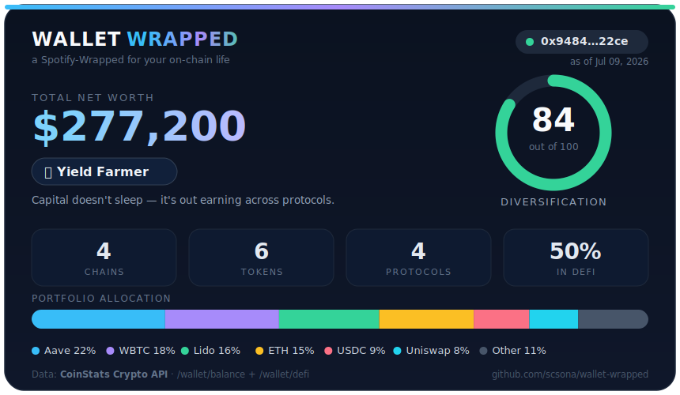

<div align="center">

# 🎁 wallet-wrapped

**Spotify Wrapped, but for any crypto wallet.** Point it at an address and it turns the wallet's on-chain life into a shareable card — net worth, chain & token mix, DeFi protocols, a diversification score, and a tongue-in-cheek **wallet persona** — all powered by the [CoinStats Crypto API](https://api.coinstats.app/).

[](https://github.com/scsona/wallet-wrapped/actions/workflows/ci.yml)
[](https://github.com/scsona/wallet-wrapped/actions/workflows/update-card.yml)
[](LICENSE)
[](https://www.python.org/)
[](https://api.coinstats.app/)

</div>

## 👇 This card is live

The image below is **regenerated every 12 hours by GitHub Actions** and committed straight back into the repo — so this README is its own running demo.

<div align="center">



</div>

> Every number on that card comes from two **[CoinStats Crypto API](https://api.coinstats.app/)** endpoints:
> **[`GET /wallet/balance`](https://coinstats.app/api-docs/openapi/get-wallet-balance/)** for the token holdings, and
> **[`GET /wallet/defi`](https://coinstats.app/api-docs/openapi/get-wallet-defi/)** for the DeFi positions.

---

## What it does

`wallet-wrapped` has two faces, one engine:

| | |
|---|---|
| 🖼️ **`card`** | Renders a self-contained `.svg` "Wrapped" card (the one above). Pure stdlib, no browser, GitHub-safe. Drop it in any README or profile and let CI keep it fresh. |
| 🖥️ **`show`** | Prints the same Wrapped — net worth, persona, allocation bar, top tokens & protocols, and a diversification gauge — straight to your terminal. |

It reads **any public wallet address**, so you can wrap your own, a friend's, or a famous one.

## Quick start

```bash
git clone https://github.com/scsona/wallet-wrapped.git
cd wallet-wrapped
pip install -e .            # installs `rich`; the card generator needs only stdlib
```

### 1. Get a free API key

Grab a key (free tier available) at **<https://api.coinstats.app/>**, then:

```bash
cp .env.example .env        # paste your key into .env
# or:  export COINSTATS_API_KEY=your_key_here
```

### 2. Wrap a wallet

```bash
wallet-wrapped show 0x94845333028B1204Fbe14E1278Fd4Adde46B22ce      # terminal report
wallet-wrapped card 0x94845333028B1204Fbe14E1278Fd4Adde46B22ce      # → assets/wrapped.svg
wallet-wrapped card 0xYourAddress -o me.svg                         # render somewhere else
wallet-wrapped show --chain ethereum 0xYourAddress                  # single chain only
```

No key handy? Every command supports `--demo` for an offline preview using bundled sample data:

```bash
wallet-wrapped show --demo
wallet-wrapped card --demo
```

## The wallet personas

Your persona is the best-fitting archetype for your portfolio mix — a deliberately playful, fully **transparent heuristic** (the scoring lives at the top of [`wallet_wrapped/wrapped.py`](wallet_wrapped/wrapped.py)). Each archetype scores itself from a handful of signals and the highest wins:

| Persona | You get it when… |
|---|---|
| 🌾 **Yield Farmer** | a big share of your stack is working in DeFi across several protocols |
| 🐋 **Blue-chip Whale** | large net worth, dominated by BTC/ETH |
| 💎 **Diamond Hands** | blue-chip heavy, barely any DeFi — just holding |
| 🛡️ **Stable Captain** | most of the book is in stablecoins |
| 🌐 **Multichain Nomad** | spread across many chains |
| 🎲 **Degen** | lots of small-cap tokens, low concentration |
| 🧺 **Diversified Trader** | spread out, holding spot, no single dominant bag |
| 🌱 **Crypto Curious** / 👻 **Ghost Wallet** | a tiny or empty wallet |

## How the diversification score works

A transparent **0–100** number — *not* a risk rating. It blends two signals over your combined holdings (each token **and** each DeFi protocol counts as one asset):

- **Spread (70%)** — `1 − HHI`, where HHI is the [Herfindahl index](https://en.wikipedia.org/wiki/Herfindahl%E2%80%93Hirschman_index) of asset weights. All-in on one bag → `0`; evenly spread → approaches `1`.
- **Breadth (30%)** — how many distinct assets you hold, saturating at 12.

The weights live in `DIVERSIFICATION_WEIGHTS` at the top of [`wallet_wrapped/wrapped.py`](wallet_wrapped/wrapped.py) — change them and you change the meaning.

## Make the README card update itself

This repo ships a GitHub Action ([`.github/workflows/update-card.yml`](.github/workflows/update-card.yml)) that regenerates the card on a schedule and commits it. To use it in **your** repo:

1. Add a repository secret named `COINSTATS_API_KEY` (Settings → Secrets and variables → Actions). Get the value from the [CoinStats Crypto API](https://api.coinstats.app/) dashboard.
2. Set the `WALLET_ADDRESS` env in the workflow to the wallet you want to feature.
3. Embed the card anywhere in your README:
   ```markdown
   
   ```
4. That's it — the workflow runs every 12 hours (and on demand via **Run workflow**). Without the secret it falls back to demo data, so forks never break.

## Which CoinStats endpoints it uses

All requests go to `https://openapiv1.coinstats.app` with your key in the `X-API-KEY` header.

| Endpoint | Used for |
|----------|----------|
| [`GET /wallet/balance`](https://coinstats.app/api-docs/openapi/get-wallet-balance/) | token holdings, prices and net worth across 120+ chains |
| [`GET /wallet/defi`](https://coinstats.app/api-docs/openapi/get-wallet-defi/) | DeFi positions (lending, LP, staking, yield) across protocols |

Both accept `address` plus either `blockchain` (a chain id, comma-separated list, or `all`) or `connectionId`. See the full reference and grab a key at **[api.coinstats.app](https://api.coinstats.app/)**.

## Project layout

```
wallet_wrapped/
  api.py          # stdlib CoinStats client (X-API-KEY, retries) for the two wallet endpoints
  wrapped.py      # the engine: net worth, allocation, personas, diversification score
  svgcard.py      # GitHub-safe SVG "Wrapped" card renderer (pure stdlib)
  report.py       # the rich terminal report
  sample_data.py  # frozen snapshot for --demo
  cli.py          # `wallet-wrapped show` / `wallet-wrapped card`
scripts/generate_card.py   # entry point for the GitHub Action
.github/workflows/         # CI + the self-updating card job
```

## Development

```bash
pip install -e ".[dev]"
pytest -q
```

## License

[MIT](LICENSE) © scsona

<div align="center">
<sub>Wallet & DeFi data by the <a href="https://api.coinstats.app/">CoinStats Crypto API</a>. Not financial advice — addresses shown are public on-chain data.</sub>
</div>
